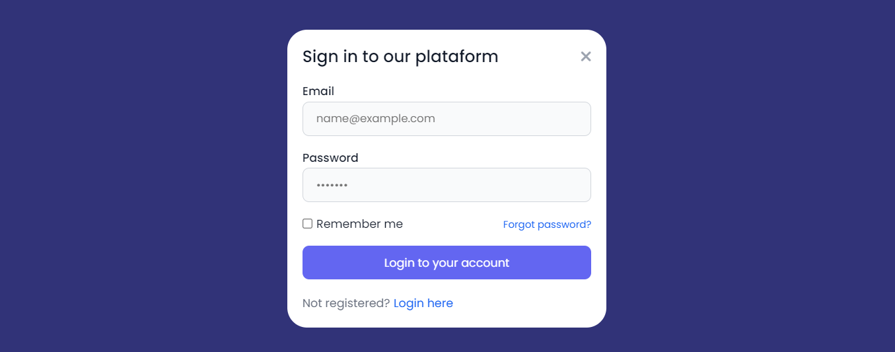

# LOGIN COM MODAL
👨‍💻FORMULÁRIO DE LOGIN COM BOTÃO DE EFEITO MODAL.

  
  

## DESCRIÇÃO:
Este site é um **formulário de login com modal**. O modal é uma janela pop-up que aparece na tela quando o botão "Open Modal" é clicado. Ele contém um formulário com campos para email, senha e opções de recuperação de senha e lembrança de login.

## COMO USAR?
- Clique no botão "Open Modal" para abrir o modal.
- Preencha os campos de login (email e senha).
- Clique em "Login to your account" para enviar os dados.
- Clique no ícone de fechar no canto superior direito do modal para fechá-lo.

## NÃO SABE?
- Entendemos que para manipular arquivos em `HTML`, `CSS` e outras linguagens relacionadas, é necessário possuir conhecimento nessas áreas. Para auxiliar nesse aprendizado, oferecemos cursos gratuitos disponíveis:
* [CURSO DE HTML E CSS](https://github.com/VILHALVA/CURSO-DE-HTML-E-CSS)
* [CURSO DE JAVASCRIPT](https://github.com/VILHALVA/CURSO-DE-JAVASCRIPT)
* [CONFIRA MAIS CURSOS](https://github.com/VILHALVA?tab=repositories&q=+topic:CURSO)

## CREDITOS:
- [PROJETO CRIADO PELO "Larissakich"](https://github.com/Larissakich/modal)
- [PROJETO EDITADO PELO VILHALVA](https://github.com/VILHALVA)